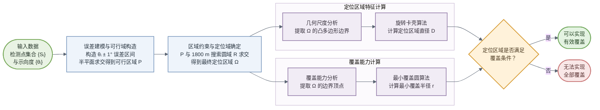

```mermaid
%%{init: {
  "theme": "base",
  "themeVariables": {
    "fontFamily": "Microsoft YaHei, SimHei, Arial",
    "fontSize": "13px",
    "lineColor": "#5B6573",
    "primaryTextColor": "#25313C"
  },
  "flowchart": {
    "curve": "basis",
    "nodeSpacing": 28,
    "rankSpacing": 35
  }
}}%%

flowchart LR

%% =========================
%% 左侧：定位区域构造
%% =========================
A(["输入数据<br/>检测点集合 {Sᵢ}<br/>与示向度 {θᵢ}"])

B["误差建模与可行域构造<br/>构造 θᵢ ± 1° 误差区间<br/>半平面求交得到可行区域 P"]

C["区域约束与定位域确定<br/>P 与 1800 m 搜索圆域 R 求交<br/>得到最终定位区域 Ω"]

A --> B --> C


%% =========================
%% 中部：两类算法并行
%% =========================
C --> G
C --> H

subgraph S1["定位区域特征计算"]
direction TB

G["几何尺度分析<br/>提取 Ω 的凸多边形边界"]

I["旋转卡壳算法<br/>计算定位区域直径 D"]

G --> I

end


subgraph S2["覆盖能力计算"]
direction TB

H["覆盖能力分析<br/>提取 Ω 的边界顶点"]

J["最小覆盖圆算法<br/>计算最小覆盖半径 r"]

H --> J

end


%% =========================
%% 右侧：汇总判定
%% =========================
I --> K
J --> K

K{"定位区域是否满足<br/>覆盖条件？"}

K -- "是" --> L(["可以实现<br/>有效覆盖"])
K -- "否" --> M(["无法实现<br/>全部覆盖"])


%% =========================
%% 样式
%% =========================
classDef inputNode fill:#E9F3E4,stroke:#78A95A,stroke-width:1.8px,color:#26352A;
classDef processNode fill:#EEF4FB,stroke:#7897BD,stroke-width:1.5px,color:#25313C;
classDef algoNode fill:#F1ECF5,stroke:#9881AC,stroke-width:1.6px,color:#332D38;
classDef decisionNode fill:#FFF2DA,stroke:#D79B32,stroke-width:1.8px,color:#4A3920;
classDef successNode fill:#E4F3E2,stroke:#70A85C,stroke-width:1.8px,color:#234322;
classDef failNode fill:#F9E7E7,stroke:#C97878,stroke-width:1.8px,color:#572D2D;

class A inputNode;
class B,C processNode;
class G,H,I,J algoNode;
class K decisionNode;
class L successNode;
class M failNode;

style S1 fill:#FCFAFD,stroke:#C6B6D2,stroke-width:1px
style S2 fill:#FCFAFD,stroke:#C6B6D2,stroke-width:1px
```