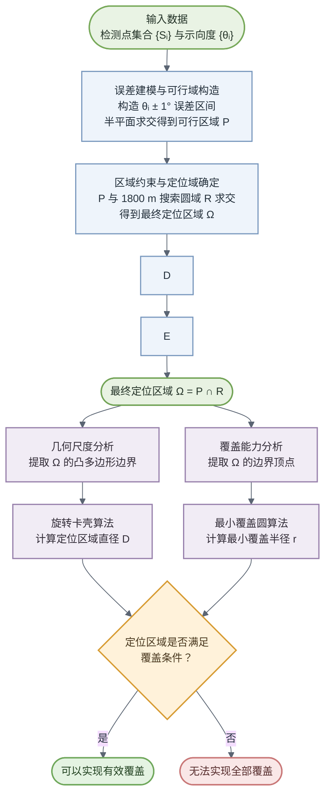

```mermaid
%%{init: {
  "theme": "base",
  "themeVariables": {
    "fontFamily": "Microsoft YaHei, SimHei, Arial",
    "fontSize": "14px",
    "lineColor": "#5B6573",
    "primaryTextColor": "#25313C"
  },
  "flowchart": {
    "curve": "basis",
    "nodeSpacing": 35,
    "rankSpacing": 30
  }
}}%%

flowchart TB

A(["输入数据<br/>检测点集合 {Sᵢ} 与示向度 {θᵢ}"])

B["误差建模与可行域构造<br/>构造 θᵢ ± 1° 误差区间<br/>半平面求交得到可行区域 P"]

C["区域约束与定位域确定<br/>P 与 1800 m 搜索圆域 R 求交<br/>得到最终定位区域 Ω"]
F(["最终定位区域 Ω = P ∩ R"])

A --> B --> C --> D --> E --> F

%% 算法并行部分
F --> G
F --> H

G["几何尺度分析<br/>提取 Ω 的凸多边形边界"]
I["旋转卡壳算法<br/>计算定位区域直径 D"]

H["覆盖能力分析<br/>提取 Ω 的边界顶点"]
J["最小覆盖圆算法<br/>计算最小覆盖半径 r"]

G --> I
H --> J

I --> K
J --> K

K{"定位区域是否满足<br/>覆盖条件？"}

K -- "是" --> L(["可以实现有效覆盖"])
K -- "否" --> M(["无法实现全部覆盖"])


classDef inputNode fill:#E9F3E4,stroke:#78A95A,stroke-width:1.8px,color:#26352A;
classDef processNode fill:#EEF4FB,stroke:#7897BD,stroke-width:1.5px,color:#25313C;
classDef algoNode fill:#F1ECF5,stroke:#9881AC,stroke-width:1.6px,color:#332D38;
classDef resultNode fill:#E8F2E2,stroke:#73A457,stroke-width:1.8px,color:#26352A;
classDef decisionNode fill:#FFF2DA,stroke:#D79B32,stroke-width:1.8px,color:#4A3920;
classDef successNode fill:#E4F3E2,stroke:#70A85C,stroke-width:1.8px,color:#234322;
classDef failNode fill:#F9E7E7,stroke:#C97878,stroke-width:1.8px,color:#572D2D;

class A inputNode;
class B,C,D,E processNode;
class F resultNode;
class G,H,I,J algoNode;
class K decisionNode;
class L successNode;
class M failNode;
```