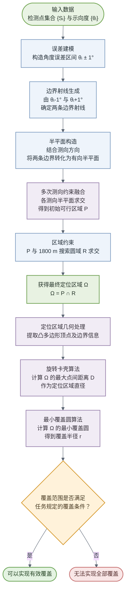

```mermaid
%%{init: {
  "theme": "base",
  "themeVariables": {
    "fontFamily": "Microsoft YaHei, SimHei, Arial",
    "fontSize": "15px",
    "lineColor": "#5B6573",
    "primaryTextColor": "#25313C"
  },
  "flowchart": {
    "curve": "basis",
    "nodeSpacing": 35,
    "rankSpacing": 38
  }
}}%%

flowchart TB

A(["输入数据<br/>检测点集合 {Sᵢ} 与示向度 {θᵢ}"])

B["误差建模<br/>构造角度误差区间 θᵢ ± 1°"]

C["边界射线生成<br/>由 θᵢ-1° 与 θᵢ+1°<br/>确定两条边界射线"]

D["半平面构造<br/>结合测向方向<br/>将两条边界转化为有向半平面"]

E["多次测向约束融合<br/>各测向半平面求交<br/>得到初始可行区域 P"]

F["区域约束<br/>P 与 1800 m 搜索圆域 R 求交"]

G["获得最终定位区域 Ω<br/>Ω = P ∩ R"]

H["定位区域几何处理<br/>提取凸多边形顶点及边界信息"]

I["旋转卡壳算法<br/>计算 Ω 的最大点间距离 D<br/>作为定位区域直径"]

J["最小覆盖圆算法<br/>计算 Ω 的最小覆盖圆<br/>得到覆盖半径 r"]

K{"覆盖范围是否满足<br/>任务规定的覆盖条件？"}

L(["可以实现有效覆盖"])
M(["无法实现全部覆盖"])

A --> B
B --> C
C --> D
D --> E
E --> F
F --> G
G --> H
H --> I
I --> J
J --> K

K -- "是" --> L
K -- "否" --> M

classDef inputNode fill:#E9F3E4,stroke:#78A95A,stroke-width:1.8px,color:#26352A;
classDef processNode fill:#EEF4FB,stroke:#7897BD,stroke-width:1.5px,color:#25313C;
classDef geometryNode fill:#F1ECF5,stroke:#9881AC,stroke-width:1.6px,color:#332D38;
classDef resultNode fill:#E8F2E2,stroke:#73A457,stroke-width:1.8px,color:#26352A;
classDef decisionNode fill:#FFF2DA,stroke:#D79B32,stroke-width:1.8px,color:#4A3920;
classDef successNode fill:#E4F3E2,stroke:#70A85C,stroke-width:1.8px,color:#234322;
classDef failNode fill:#F9E7E7,stroke:#C97878,stroke-width:1.8px,color:#572D2D;

class A inputNode;
class B,C,D,F processNode;
class E,H,I,J geometryNode;
class G resultNode;
class K decisionNode;
class L successNode;
class M failNode;
```