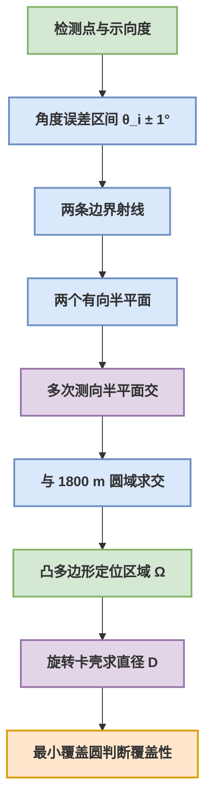

```mermaid
graph TD
    %% 定义学术规范配色与样式
    classDef inputNode fill:#d5e8d4,stroke:#82b366,stroke-width:2px,color:#333,font-weight:bold;
    classDef processNode fill:#dae8fc,stroke:#6c8ebf,stroke-width:2px,color:#333,font-weight:bold;
    classDef algoNode fill:#e1d5e7,stroke:#9673a6,stroke-width:2px,color:#333,font-weight:bold;
    classDef decisionNode fill:#ffe6cc,stroke:#d79b00,stroke-width:2px,color:#333,font-weight:bold;

    %% 节点定义
    A[检测点与示向度]:::inputNode
    B[角度误差区间 θ_i ± 1°]:::processNode
    C[两条边界射线]:::processNode
    D[两个有向半平面]:::processNode
    E[多次测向半平面交]:::algoNode
    F[与 1800 m 圆域求交]:::processNode
    G[凸多边形定位区域 Ω]:::inputNode
    H[旋转卡壳求直径 D]:::algoNode
    I[最小覆盖圆判断覆盖性]:::decisionNode

    %% 逻辑连线
    A --> B
    B --> C
    C --> D
    D --> E
    E --> F
    F --> G
    G --> H
    H --> I
```